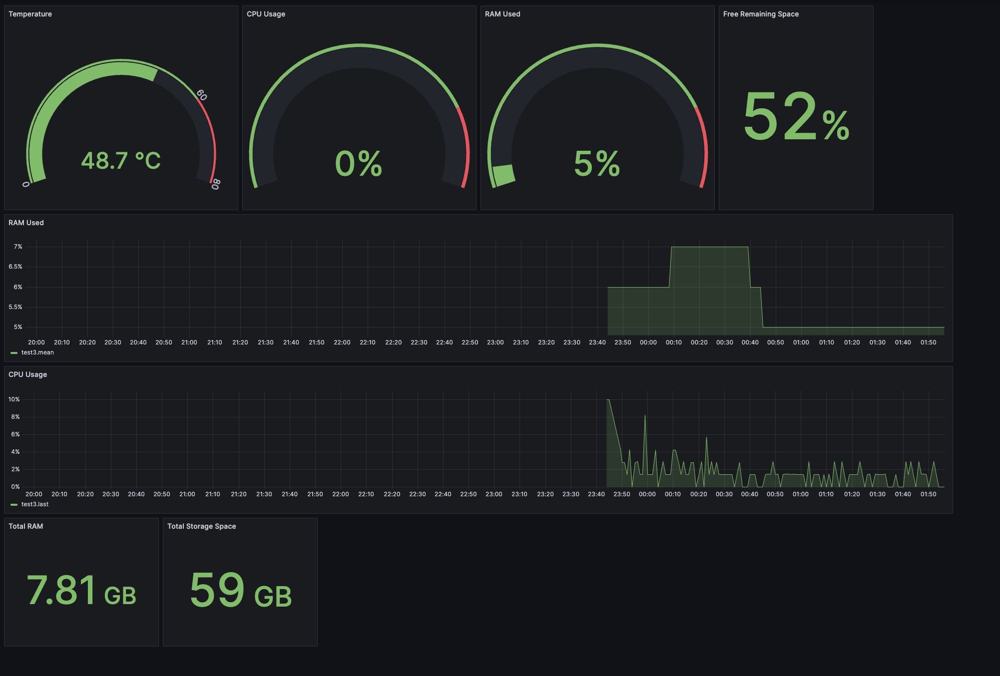

# Monitoring Pi Resources with Grafana

## Steps

### Install Grafana

[Reference](https://grafana.com/tutorials/install-grafana-on-raspberry-pi/)

1. Add the APT key used to authenticate packages:

```bash
wget -q -O - https://packages.grafana.com/gpg.key | sudo apt-key add -
```

2. Add the Grafana APT repository

```bash
echo "deb https://packages.grafana.com/oss/deb stable main" | sudo tee -a /etc/apt/sources.list.d/grafana.list
```

3. Install Grafana

```bash
sudo apt-get update
sudo apt-get install -y grafana
```

Grafana is now installed, but not yet running. To make sure Grafana starts up even if the Raspberry Pi is restarted, we need to enable and start the Grafana Systemctl service.

4. Enable the Grafana server

```bash
sudo /bin/systemctl enable grafana-server
```

5. Start the Grafana server

```bash
sudo /bin/systemctl start grafana-server
```

Grafana is now running on the machine and is accessible from any device on the local network.

Open a browser and go to [raspberrypi.local:3000](raspberrypi.local:3000).

### Install InfluxDB

[Reference](https://docs.influxdata.com/influxdb/v1/introduction/install/)

1. Add InfluxData apt-get repository

```bash
# influxdata-archive_compat.key GPG Fingerprint: 9D539D90D3328DC7D6C8D3B9D8FF8E1F7DF8B07E
wget -q https://repos.influxdata.com/influxdata-archive_compat.key
echo '393e8779c89ac8d958f81f942f9ad7fb82a25e133faddaf92e15b16e6ac9ce4c influxdata-archive_compat.key' | sha256sum -c && cat influxdata-archive_compat.key | gpg --dearmor | sudo tee /etc/apt/trusted.gpg.d/influxdata-archive_compat.gpg > /dev/null
echo 'deb [signed-by=/etc/apt/trusted.gpg.d/influxdata-archive_compat.gpg] https://repos.influxdata.com/debian stable main' | sudo tee /etc/apt/sources.list.d/influxdata.list
```

2. Install and start the InfluxDB service

```bash
sudo apt-get update && sudo apt-get install influxdb
sudo service influxdb start
```

3. Configure InfluxDB

```bash
sudo nano /etc/influxdb/influxdb.conf
```
Most of the settings in the local configuration file (/etc/influxdb/influxdb.conf) are commented out; all commented-out settings will be determined by the internal defaults. Any uncommented settings in the local configuration file override the internal defaults.

Uncomment the following three lines from the config:

```
[http]
    enabled = true

    bind-address = ":8086"

    auth-enabled = false
```

Point the process to the configuration file by using the `-config` option e.g.

```bash
influxd -config /etc/influxdb/influxdb.conf
```

another way to source the config file is through the `INFLUXDB_CONFIG_PATH` where the value is the path of the config file.

Test to see if it works:

```bash
influx -precision rfc3339
```

4. Create databases in InfluxDB

start the InfluxDB shell with

```bash
influx -precision rfc3339
```

can create a new database with

```
CREATE DATABSE mydb
```

in the shell. The creation of the database can be verified by

```
SHOW DATABASES
```

The new created database should show up in the output.

### Connect InfluxDB as a Grafana Data Source

This can be done by going to the running Grafana console and selecting the option to create a new data source. InfluxDB should be available as one of the options and the data source configuration can be set up based on how the DB was setup in the previous step.

### Measurements Recording

The bash script `runPI.sh` will execute a python task (`monitorPi.py`) in which some measurements for resource usage will
be written to the influxDB table. To run the script, will need to make the file executable:

```bash
chmox +x runPi.sh
```

we will also need to automate the execution of this script to consistently capture the measurements. [crontab](https://man7.org/linux/man-pages/man5/crontab.5.html) can be used for scheduling.

To add a new scheduled event to crontab, run

```bash
crontab -e
```

in the terminal and in the file that opens add the following entry at the end

```
* * * * * /path/to/your/script
```

If the logs are needed for debugging purposes, can update the execution command to capture logs
in a specific file:

```
* * * * * /path/to/your/script >> /path/to/logfile.log 2>&1
```

The first five arguments represent the cron schedule for running the script and the last
entry is the absoloute path to the script.

**Note** in general when working in crontab, relative paths were flaky so all paths are absoloute.

### Create Grafana Dashboards

Now the running Grafana instance should have access to the streaming measurements in InfluxDB
via the configured data source. Visualizations can be built using this data to create a monitoring dashboard.



## References

[1] [Monitor Raspberry Pi resources and parameters with Grafana board - Andreea Sonda](https://andreea-sonda31.medium.com/monitor-raspberry-pi-resources-and-parameters-with-grafana-board-part-1-ab0567303e8)